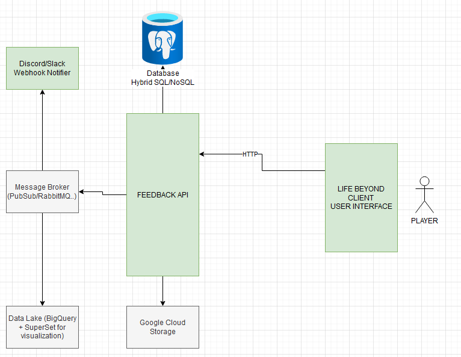

# darewise-test
Darewise test, feedback API


## Architecture

This is an example architecture of what I would have done

Feedback API publishing message to a broker (Google PubSub, RabbitMQ...)

It would then go to several subscribers, for example, could be nice to have notification for bug reports on a discord channel through webhooks

It could be nice to have a KPI dashboard from the data generated by feedback 



## Implementation

I made a simple JWT secured web application

About file upload, it does not upload directly to GCS because of [what is not working](#what-is-not-working)), however, I made it working to your own file system (to show that it works and it's just about wrapping GCS to get it fully working, I did that wrapping in a class `GcsBlobStorage`)

I made some basic unit tests, mainly technical ones. 
I believe (at least for **micro**services) that unit tests should be used for libraries or tricky scenarios, otherwise, it should be end-to-end tests to ensure everything works as defined in the protocol.

I did not pursue much more, I'm not learning anything and I can not reuse this code for another project.

- [OpenAPI Spec](docs/openapi.json) generated from Swashbuckle
- [Postman Collection](docs/Feedback.postman_collection.json) Generated from OpenAPI Specs & tweaked for ease of use

## Getting started
- Start PostgreSQL
```shell
docker run -p 5432:5432 --name feedback-api-database -e POSTGRES_PASSWORD=strong_pass2018 --restart always -d postgres:13
```

- Start the API
```shell
dotnet run --project srcs/Darewise.Feedback
```

- Import Postman collection & start testing
- Upload files (it will get to your file system locally


## Tools/Packages used

- .NET 6 / C#
- JsonWebTokens - JWT for security
- EFCore.NpgSQL - SQL ORM with NoSQL columns capabilities
- MapsterMapper - Object Mapping to avoid manual mapping, just sugar syntax with negligible performance impact
- Moq - Mocking library
- NFluent - Fluent assertion library
- NBuilder - Fluent Fake Object creation library


## What is not working
- GCP related stuff (GCS is not plugged because I don't have GCP account unless I put my credit card there)


## Nice to have

I would have added these things if I had more time:
- [Integration Tests](https://www.npmjs.com/package/newman) Postman collection with CLI based integration test
- [CloudEvents](https://cloudevents.io/) CloudEvents specification should be implemented for inter services messages (broker)
- [Prometheus](https://prometheus.io/) metrics for software monitoring (qps, bytes uploaded count...)
- [Grafana](https://grafana.com) Dashboard for software metrics visualization & alerting (+ alert manager)
- [Sentry](https://sentry.io) Sentry to group up all software exceptions & faster fixing
- [Superset](http://superset.apache.org/) dashboard with user related KPIs
